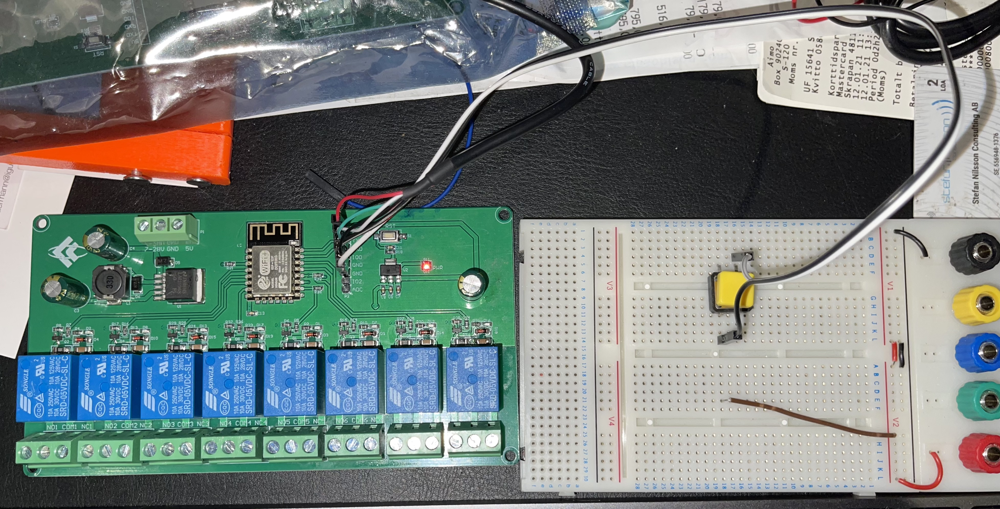
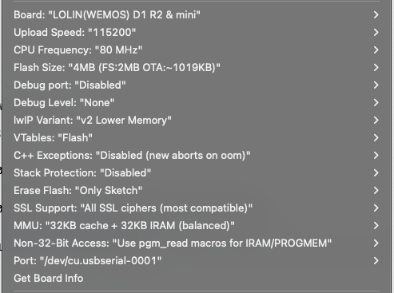

# wifi-relay-ctrl
Wifi 8 channel Relay Board (ESP12F_Relay_X8_V1.1 / 303ESP12F06)

---
Add: **WifiConfig.h:**
```
const char *ssid = "abe*family";
const char *password = "...";
```
---
**Adafruit 954 USB<->TTL Cable used**:

https://www.adafruit.com/product/954

---
**Programming Wiriing:**

**IO1** connected to **GND** via (yellow) **Push Button** for programming mode.


---
**Arduino IDE Config:**



---